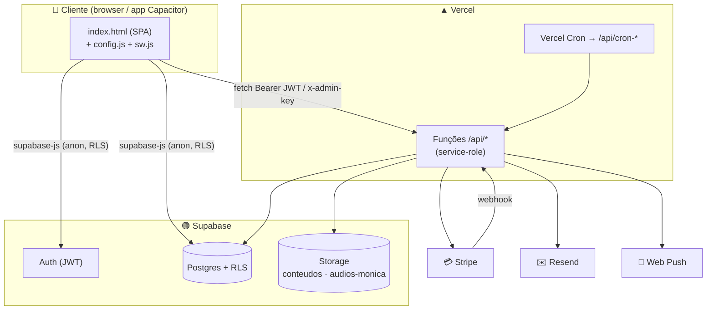
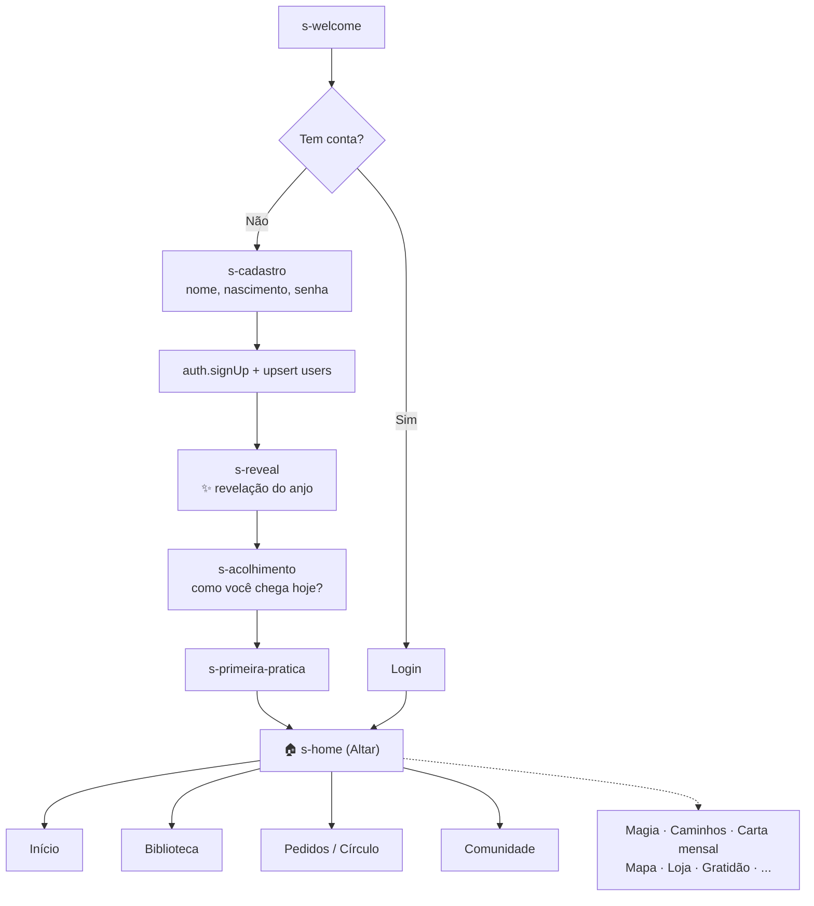
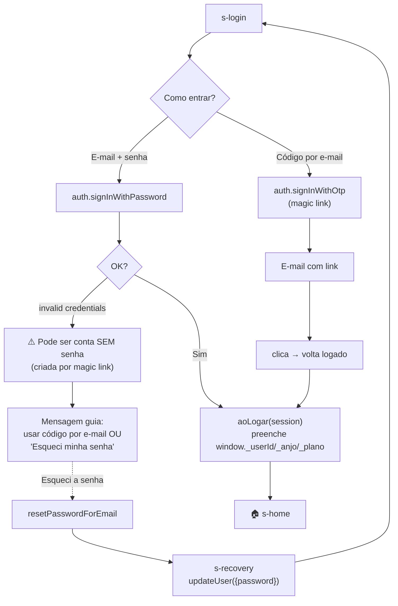
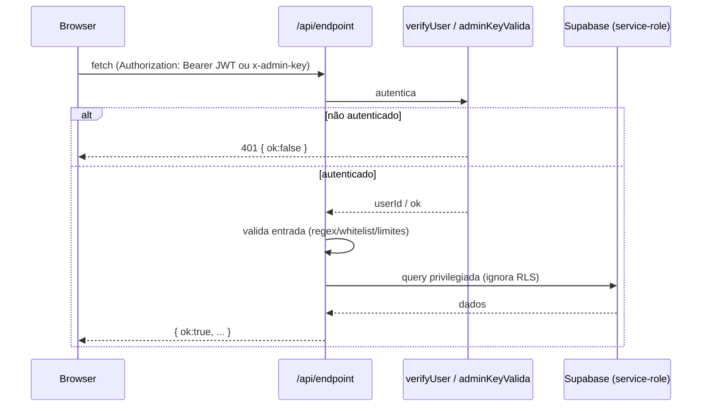
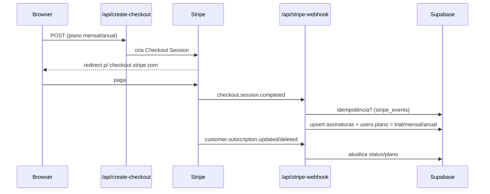
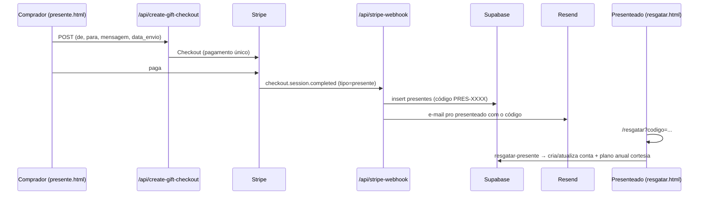
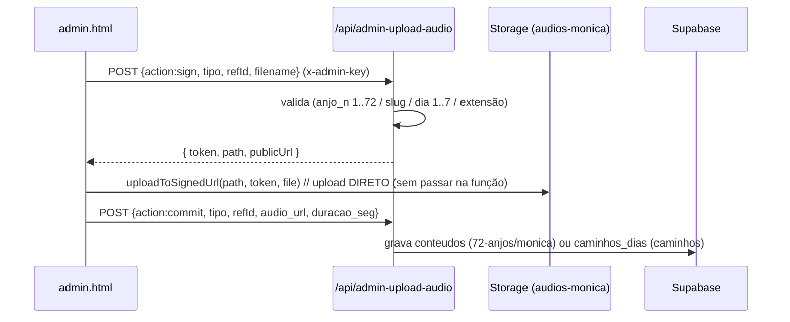
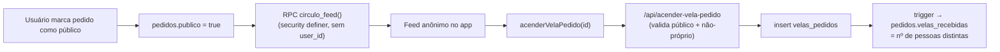
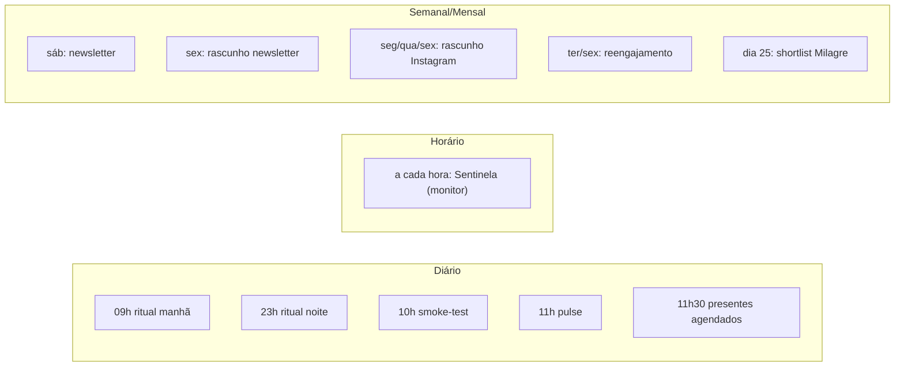

# Fluxogramas

[← voltar ao índice](./README.md)

Diagramas em [Mermaid](https://mermaid.js.org/) — renderizam automaticamente no GitHub. Editáveis como texto.

## Arquitetura (alto nível)

## Jornada do usuário (onboarding → uso)

## Autenticação (login)

## Ciclo de uma requisição privilegiada

## Pagamento — assinatura premium

## Presente (gift) — pagamento único + resgate

## Upload de áudio (admin, signed-URL)

## Círculo de Velas (anônimo)

## Agentes (cron) — visão de quando rodam

