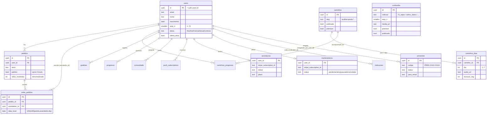

# Modelo de dados

[← voltar ao índice](./README.md)

Banco: **Postgres no Supabase**. Toda tabela tem **RLS (Row Level Security) ligada**. A regra geral: o cliente só enxerga/edita as próprias linhas; o servidor (service-role) ignora RLS para operações privilegiadas.

> Fonte canônica do schema: `supabase/schema.sql` + os `MIGRACAO_*.sql`. Auditoria de RLS: `AUDITORIA_RLS.sql`.

## Diagrama ER

Relações principais (FKs). `users.id` = `auth.users.id` (Supabase Auth). Colunas resumidas para leitura — o schema completo está no `.sql`.

> Tabelas **sem FK direta pra users** (globais/operacionais): `conteudos`, `milagres`, `leads`, `stripe_events`, `sentinela_checks`. `conteudos.anjo_n` referencia logicamente um dos 72 anjos (não é FK — os anjos vivem em código, não em tabela).

## Tabelas

| Tabela | O que guarda | Observações |
|---|---|---|
| **users** | Perfil do usuário (nome, email, nascimento, `anjo_n`/`anjo_nome`, `ritual_horario`, `plano`, `oferta_*`, `whatsapp`, consent LGPD, `ultimo_acesso_em`) | Espelha `auth.users` (mesmo `id`). `plano ∈ free/trial/mensal/anual` (+`cortesia` setado pela equipe). **Escrita restrita por coluna** (ver Hardening). |
| **pedidos** | Pedidos de oração do usuário. `publico` (opt-in p/ Círculo), `velas_recebidas` (denormalizado), `publicado_em` | Base do **Círculo de Velas**. |
| **velas_pedidos** | "Velas" acesas por usuários nos pedidos de outros (1 por pessoa×pedido×dia) | Trigger mantém `pedidos.velas_recebidas` = nº de **pessoas distintas**. |
| **caminhos** | Os Caminhos guiados (slug, título, emoji, ordem, `publicado`, `premium`) | 3 caminhos: acolher-perda, atravessar-ansiedade, receber-prosperidade. |
| **caminhos_dias** | Os 7 dias de cada caminho (`dia`, `titulo`, `texto`, `audio_url`, `duracao_seg`) | 3×7 = 21 áudios da Monica. |
| **caminhos_progresso** | Progresso do usuário em cada caminho | `dia_atual`, `ultimo_dia_feito`. |
| **conteudos** | Biblioteca: áudios/vídeos/textos/salmos por `colecao` | `colecao ∈ salmo_diario, mensagem_semana, 72_anjos, protecao, prosperidade, para_dormir…`. `anjo_n` p/ conteúdo de anjo específico. `premium`, `publicado`, `data_pub` (agendamento). |
| **milagres** | Milagre do mês (depoimentos selecionados) | `publicado`. |
| **comunidade** | Posts da comunidade | `oculto` (moderação). |
| **gratidao** | Diário de gratidão do usuário | privado (self). |
| **progresso** | Progresso/streak de práticas | privado (self). |
| **leads** | Captação de e-mail (newsletter) | opt-in. |
| **indicacoes** | Programa de indicação (referral) | `indicador_id`, `virou_assinante`. |
| **assinaturas** | Assinatura premium (Stripe) | `stripe_subscription_id`, `status`, `plano`, `periodo_fim`. |
| **mantenedores** | "Oferta dos Mantenedores" (assinatura voluntária R$9,90) | status pendente/ativa/pausada/cancelada. Escrita só via webhook. |
| **presentes** | Presentes (assinatura anual presenteada) | `codigo` de resgate, `status`, `para_email`. |
| **push_subscriptions** | Inscrições de Web Push do usuário | usado por `cron-ritual`. |
| **stripe_events** | Idempotência do webhook (`event.id` já processado) | evita processar 2× (cobrança dupla). |
| **sentinela_checks** | Histórico do monitoramento (agente Sentinela) | falhas consecutivas → alerta. |

## RLS — o modelo mental

- **Tabelas "self"** (users, pedidos, gratidao, progresso, caminhos_progresso, push_subscriptions, mantenedores, velas leitura própria…): policy do tipo `using (auth.uid() = user_id)`. O usuário só vê o que é dele.
- **Tabelas de leitura pública controlada** (conteudos, milagres, comunidade, caminhos): `using (publicado = true / publico = true / oculto = false)`.
- **O Círculo é anônimo de verdade:** a leitura direta de `pedidos` públicos foi **removida** da RLS (expunha `user_id`). O feed vem da função `security definer` **`circulo_feed()`**, que devolve só colunas públicas e exclui os pedidos do próprio usuário. Ver `MIGRACAO_HARDENING.sql`.
- **Escritas privilegiadas** (plano, billing, dados de outros) → service-role nas funções `/api`, que **ignora RLS**.

### Hardening de `users` (importante)

RLS é **row-level, não column-level**. Sem proteção extra, um usuário poderia rodar no console `client.from('users').update({ plano: 'anual' })` e se dar premium. Por isso há **GRANTs por coluna**: o papel `authenticated` só pode escrever colunas de **perfil** (nome, nascimento, anjo, whatsapp, ritual_horario, consent, ultimo_acesso). `plano` e `oferta_*` só pela service-role (webhook/admin). Definido em `MIGRACAO_HARDENING_2.sql` (espelhado em `supabase/schema.sql`).

## Storage (buckets)

| Bucket | Conteúdo | Como sobe |
|---|---|---|
| **conteudos** | Mídias gerais (vídeos, áudios, salmos) | `admin-upload-url.js` (signed URL) → upload direto do browser |
| **audios-monica** | Áudios dos roteiros (72 anjos + Caminhos + gerais) | `admin-upload-audio.js` (signed URL). **MIME e tamanho (50MB) são impostos na config do bucket** |

> **Por que signed-URL e não upload via função?** Funções da Vercel têm limite de ~4.5MB no corpo. O arquivo sobe **direto do browser pro Storage** com um token assinado que a função emite. Ver [BACKEND → Upload de áudio](./BACKEND.md#upload-de-áudio-signed-url).

## Migrações

Rodadas **à mão** no SQL Editor do Supabase, em ordem cronológica. Idempotentes.

| Arquivo | Adiciona |
|---|---|
| `supabase/schema.sql` | **base**: users, pedidos, conteudos, assinaturas, push, progresso, gratidao, leads, comunidade, milagres + RLS |
| `MIGRACAO_USERS_CADASTRO.sql` | colunas de cadastro completo em users |
| `MIGRACAO_ULTIMO_ACESSO.sql` | `users.ultimo_acesso_em` |
| `MIGRACAO_NEWSLETTER.sql` | leads/newsletter |
| `MIGRACAO_INDICACOES.sql` | indicacoes (referral) |
| `MIGRACAO_PRESENTES.sql` | presentes |
| `MIGRACAO_STRIPE_EVENTS.sql` | stripe_events (idempotência) |
| `MIGRACAO_MENSAGENS_MENSAIS.sql` | carta/mensagem mensal |
| `MIGRACAO_CIRCULO_VELAS.sql` | pedidos públicos + velas_pedidos + `circulo_feed()` |
| `MIGRACAO_VELAS_HOJE.sql` / `MIGRACAO_VELAS_DISTINTAS.sql` | RPCs de velas + contagem por pessoas distintas |
| `MIGRACAO_CAMINHOS.sql` | caminhos, caminhos_dias, caminhos_progresso + seed dos 3×7 |
| `MIGRACAO_CONTEUDOS_TAGS.sql` | tags/sentimentos em conteudos |
| `MIGRACAO_OFERTA.sql` | mantenedores (Oferta) |
| `MIGRACAO_SENTINELA.sql` | sentinela_checks (monitoramento) |
| `MIGRACAO_HARDENING.sql` | **segurança**: circulo_feed anônimo, RLS de velas, mantenedores select-only |
| `MIGRACAO_HARDENING_2.sql` | **segurança**: GRANTs por coluna em users, leitura de velas restrita |

> **Ao criar uma feature nova com tabela:** crie um `MIGRACAO_*.sql` novo, atualize `supabase/schema.sql` para refletir, e documente aqui. Há um cabeçalho "anti-drift" em alguns arquivos apontando os espelhos — respeite-o.
